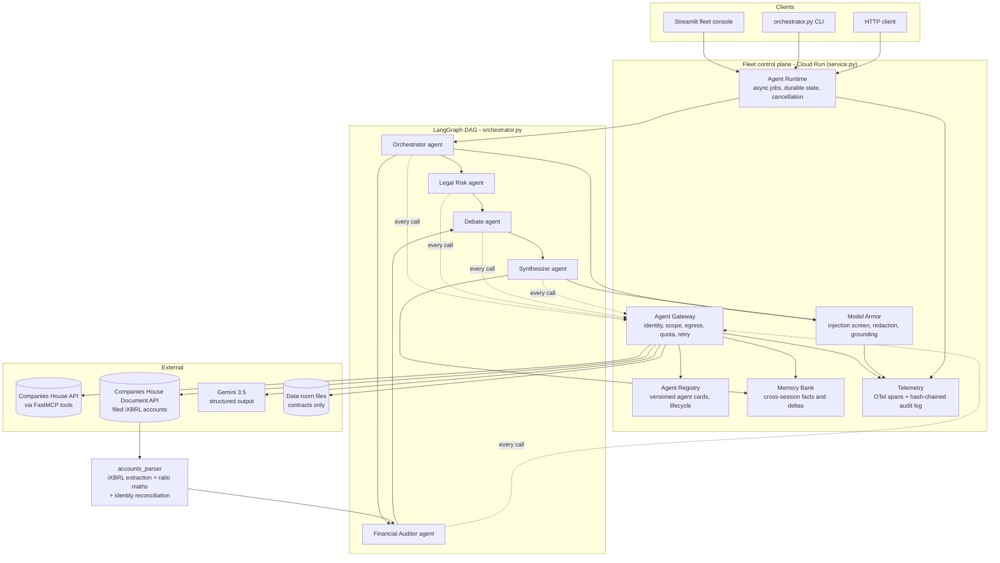
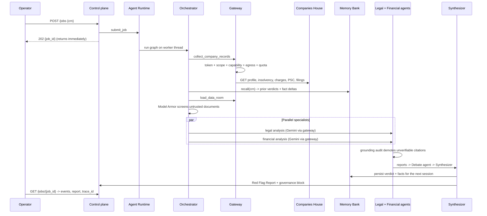
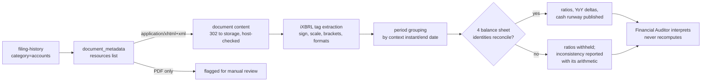

# DueDiligence Direct - Architecture

Track: **The Fortified Enterprise Fleet** (All Things Agentic Hackathon).

A governed fleet of specialist agents that performs UK M&A red-flag diligence from
live Companies House statutory data plus a local data room, and returns a Red Flag
Report with a citation for every claim.

## 1. System view

## 2. Request lifecycle

## 3. Track requirements mapping

| Track component | Implementation | Where |
| --- | --- | --- |
| Agent Registry (publish, version, lifecycle) | SQLite-backed agent cards; `resolve_agent` picks the highest ACTIVE semantic version; ACTIVE / DEPRECATED / RETIRED transitions; capability lookup | `agent_registry.py` |
| Agent Runtime (async background operation) | Thread-pool runtime with durable SQLite job state, live stage events, cooperative cancellation, restart reconciliation | `runtime.py`, `service.py` |
| Memory Bank (persistent cross-session context) | Per-company audit history, tracked fact sheet, operator notes, and a significance-scored delta injected into every agent prompt | `memory_bank.py` |
| Agent Identity | Per-agent principals with scopes and short-lived HMAC-signed tokens; signing key from Secret Manager in production | `agent_identity.py` |
| Gateway (policy enforcement) | Single choke point: identity, registry lifecycle, published capability, scope, egress allowlist, per-agent quota, retry with backoff; allow and deny both audited | `gateway.py` |
| Model Armor (guardrails) | Prompt-injection screening and quarantine, credential and PII redaction, deterministic citation grounding, output framing and disclaimer enforcement | `model_armor.py` |
| OpenTelemetry audit logs | OTel spans per agent stage with fleet attributes, OTLP or Cloud Trace export, plus a hash-chained JSONL audit log with a verifier | `telemetry.py` |
| Gemini 3.5 | `gemini-3.5-flash` with Pydantic-constrained structured output; documented fallback chain | `orchestrator.py` |
| Deterministic financials | iXBRL extraction from the company's filed accounts plus ratio, trend, runway, and accounting-identity mathematics in plain Python | `accounts_parser.py`, `mcp_server.py` |
| Google agent framework | Google GenAI SDK (`google-genai`) driving every agent node | `orchestrator.py` |
| Google Cloud infrastructure | Cloud Run service, Artifact Registry image, Cloud Build pipeline, Secret Manager secrets, Cloud Trace export | `Dockerfile`, `cloudbuild.yaml`, `service.py` |

## 4. The financial data path

The credential is never replayed across the storage redirect: the 302 is followed manually,
the destination host is checked against an allowlist, and the signed URL is fetched without
the API key attached.

## 5. Trust boundaries

1. **Untrusted**: data room documents supplied by the seller. Screened by Model Armor
   before they reach any prompt; multi-vector injection is quarantined, not sanitized. A data
   room document can never override a figure from the statutory filing.
2. **Semi-trusted**: model output. Constrained by Pydantic schemas, then citation-checked
   against the source payload; unverifiable HIGH claims are capped at MEDIUM. The model is
   never the source of a number.
3. **Semi-trusted**: the filed accounts themselves. Authentic and statutory, but self-tagged
   by the filer, so they are reconciled against four balance sheet identities before any ratio
   derived from them is published.
4. **Trusted**: Companies House API payloads and the fleet's own state, reached only through
   the gateway with a scoped token and an egress allowlist.

## 6. Failure behaviour

| Failure | Behaviour |
| --- | --- |
| Companies House key missing or endpoint down | Tool returns a status record, gateway retries transient statuses, agents mark it a limitation and the verdict moves to PROCEED WITH CAUTION |
| Gemini unavailable, out of quota, or model id retired | Model candidate chain, then deterministic fallback analysis with the cause named (`quota_exhausted`, `model_unavailable`, `credentials_rejected`). Figures and citations are unchanged because they are computed in Python; only the narrative degrades |
| Accounts filed only as a scanned PDF | Reported as `no_ixbrl_available` and escalated for manual review; no figures are guessed |
| Filing tags contradict each other | Affected ratios withheld, `filing_internally_inconsistent` reported with the failing identity and its arithmetic |
| Agent requests an undeclared tool or an unowned scope | Gateway denies, writes a deny record, and the node degrades instead of crashing |
| Process restart mid-run | LangGraph SQLite checkpoints retain graph state; jobs left in flight are reconciled to INTERRUPTED |
| Poisoned data room document | Quarantined by Model Armor and surfaced as its own governance finding |
