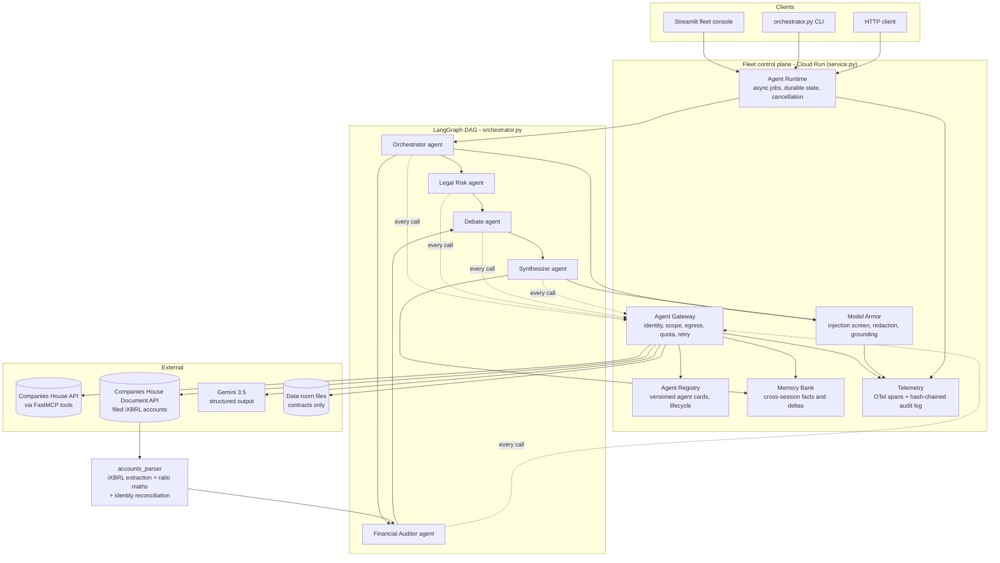
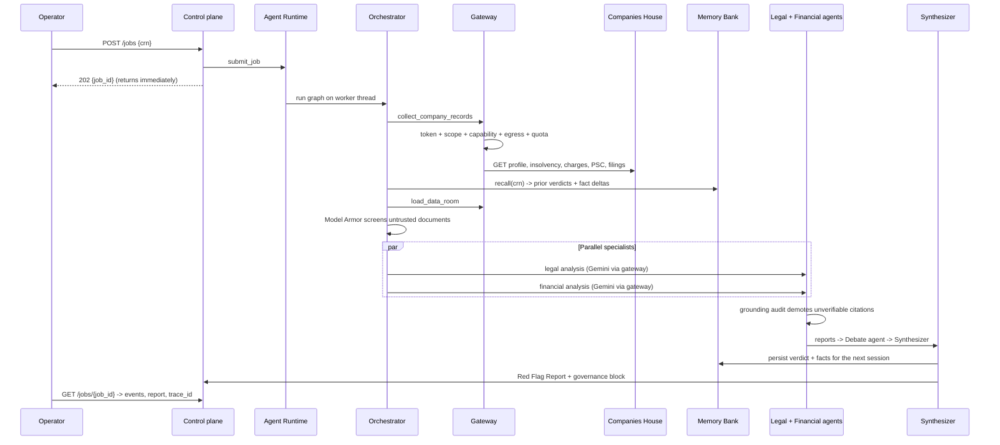
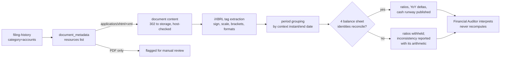

# DueDiligence Direct - Architecture

Track: **The Fortified Enterprise Fleet** (All Things Agentic Hackathon).

A governed fleet of specialist agents that performs UK M&A red-flag diligence from
live Companies House statutory data plus a local data room, and returns a Red Flag
Report with a citation for every claim.

## 1. System view

## 2. Request lifecycle

## 3. GEAP component mapping, and how to verify each one

Every component below is implemented and running. The right-hand column is a single
command that proves it, so none of this has to be taken on trust.

`URL` is the deployed control plane; `TOKEN=$(gcloud auth print-identity-token)`.

| GEAP component | Implementation | Verify it |
| --- | --- | --- |
| **Agent Registry** discovery, versioning, lifecycle | Six principals publish versioned cards to SQLite. Dispatch resolves the highest ACTIVE semantic version; ACTIVE / DEPRECATED / RETIRED transitions reroute traffic; capability lookup | `curl -H "Authorization: Bearer $TOKEN" $URL/fleet \| jq '.agents[].agent_id, .agents[].version'` |
| **Agent Runtime** long-running async execution | Thread-pool runtime, durable SQLite job state, live stage events, cooperative cancellation, restart reconciliation to INTERRUPTED | `curl -X POST -H "Authorization: Bearer $TOKEN" -d '{"crn":"03994971"}' $URL/jobs` returns **202 with a job id in under a second**, work continues server-side |
| **Memory Bank** secure cross-session context | Per-company audit history, tracked statutory fact sheet, operator notes, significance-scored deltas injected into every agent prompt | `curl -H "Authorization: Bearer $TOKEN" $URL/memory/03994971 \| jq '.prior_audits, .changes_since_last_audit'` |
| **Agent Identity** zero-trust access control | Each agent is a principal with its own scopes and short-lived HMAC-signed tokens, verified per call. Signing key from Secret Manager | `python -c "import agent_identity as a; a.mint_token('debate', audience='fleet-gateway', scopes=[a.SCOPE_STATUTORY_READ])"` → **IdentityError**: the Debate agent cannot obtain statutory scope |
| **Agent Gateway** unified routing and policy | One choke point: identity → registry lifecycle → published capability → scope → egress allowlist → per-agent quota → retry, with terminal errors failing fast. Allow *and* deny are audited | `python -c "import gateway, orchestrator; gateway.call('debate','collect_company_records', crn='03994971')"` → **PolicyViolation**, and the denial appears in `/audit` |
| **Model Armor** injection, poisoning, PII | Untrusted documents screened before any prompt: single-vector injection neutralised, multi-vector quarantined, credentials and PII redacted. Model output grounded — every citation string-matched to source, unverifiable HIGH claims demoted | `python orchestrator.py 03994971 --data-room sample_data_room_hostile --no-save` → **`Quarantined 1 document(s)`**, and the tampering is reported as a finding |
| **Agent Observability** OTel logs and reasoning traces | OTel span per agent stage exported to Cloud Trace, `agent.exchange` events carrying the full inter-agent reasoning chain, plus a hash-chained audit log | `curl -H "Authorization: Bearer $TOKEN" $URL/audit/verify` → `{"valid": true, ...}`; each job returns a `trace_id` resolvable in Cloud Trace |
| **Gemini 3.5 or newer** | `gemini-3.5-flash` on Vertex AI with Pydantic-constrained structured output | `jq '.result.governance.model_tiers'` on any finished job |
| **Additional Google models** | Gemma (`gemma-4-26b-a4b-it`) triages documents; `gemini-embedding-001` detects paraphrased risk clauses | same `model_tiers` block shows all three tiers |
| **Google agent framework** | Google GenAI SDK drives every agent node | `orchestrator.py` |
| **Google Cloud infrastructure** | Cloud Run, Vertex AI, Cloud Build, Artifact Registry, Secret Manager, Cloud Trace | the live service URL |
| **Institutional data source** | UK Companies House statutory register and Document API — live production data, read-only | any run's `raw_statutory_data` carries seven endpoints |

Everything above is covered by the 78-test suite, which needs no network:
`python -m unittest discover -s tests -t .`

## 4. The financial data path

The credential is never replayed across the storage redirect: the 302 is followed manually,
the destination host is checked against an allowlist, and the signed URL is fetched without
the API key attached.

## 5. Compliance, sovereignty, and the production-data posture

The track asks how agents interact with production data without breaching compliance,
data sovereignty, or security policy. This fleet does not use synthetic stand-ins: it
reads the **live UK Companies House register**, the statutory system of record, plus the
target company's own filed iXBRL accounts.

### Data classification

| Class | Source | Handling |
| --- | --- | --- |
| Public statutory data | Companies House API and Document API | Read-only; published under the Companies Act as a public register |
| Personal data within it | Officer and PSC names, partial dates of birth, service addresses | Processed for KYB/AML diligence, the register's statutory purpose; displayed as filed, never enriched or cross-matched against private sources |
| Confidential deal documents | Operator uploads | Screened by Model Armor, redacted for credentials and PII, held on the fleet's own disk, never sent to a third party |
| Fleet state | Registry, memory, jobs, audit log | Local to the deployment; no external store |

### Every external call is read-only

The fleet cannot alter the register. Statutory access is exclusively HTTP `GET`
(`mcp_server.py`), and the only outbound write in the entire system is the optional
notification POST to an endpoint the operator configures. All mutations - job state,
memory, audit records, uploads - are confined to the deployment's own storage.

### Residency

Cloud Run, Artifact Registry, Secret Manager, and all fleet state run in
`europe-west1`, and `FLEET_DATA_REGION` records that in every trace and audit record.

**One honest caveat:** model inference uses Vertex AI's `global` endpoint, because
`europe-west1` does not serve `gemini-3.5-flash`. Inference is therefore not pinned to a
single region, while all storage and statutory data remain in the EU. A deployment with a
strict residency requirement should pin `GOOGLE_CLOUD_LOCATION` to an EU region and accept
whichever model that region serves; the model id is configuration, not code. The code no
longer carries a US default, so a misconfiguration cannot silently send data to `us-central1`.

### Security controls, and what enforces them

| Control | Enforced by |
| --- | --- |
| Least privilege per agent | Scoped identities; the Debate agent holds no statutory scope |
| No unauthorised egress | Gateway allowlist; a tool declaring an unlisted host is refused |
| Credential containment | The Companies House key is never replayed across the document storage redirect; secrets come from Secret Manager, never the image |
| Untrusted input containment | Model Armor screens every uploaded document before any prompt |
| Tamper evidence | Hash-chained audit log with `/audit/verify` |
| Attribution | OpenTelemetry trace id on every record, finding, and exported report |
| Human authority | The fleet recommends; it never approves. Every report names what a human must verify |

### What this does not claim

It is not a regulated compliance product, it holds no accreditation, and its output is
diligence support rather than advice - a constraint Model Armor enforces on every report.

## 6. Trust boundaries

1. **Untrusted**: data room documents supplied by the seller. Screened by Model Armor
   before they reach any prompt; multi-vector injection is quarantined, not sanitized. A data
   room document can never override a figure from the statutory filing.
2. **Semi-trusted**: model output. Constrained by Pydantic schemas, then citation-checked
   against the source payload; unverifiable HIGH claims are capped at MEDIUM. The model is
   never the source of a number.
3. **Semi-trusted**: the filed accounts themselves. Authentic and statutory, but self-tagged
   by the filer, so they are reconciled against four balance sheet identities before any ratio
   derived from them is published.
4. **Trusted**: Companies House API payloads and the fleet's own state, reached only through
   the gateway with a scoped token and an egress allowlist.

## 7. Failure behaviour

| Failure | Behaviour |
| --- | --- |
| Companies House key missing or endpoint down | Tool returns a status record, gateway retries transient statuses, agents mark it a limitation and the verdict moves to PROCEED WITH CAUTION |
| Gemini unavailable, out of quota, or model id retired | Model candidate chain, then deterministic fallback analysis with the cause named (`quota_exhausted`, `model_unavailable`, `credentials_rejected`). Figures and citations are unchanged because they are computed in Python; only the narrative degrades |
| Accounts filed only as a scanned PDF | Reported as `no_ixbrl_available` and escalated for manual review; no figures are guessed |
| Filing tags contradict each other | Affected ratios withheld, `filing_internally_inconsistent` reported with the failing identity and its arithmetic |
| Agent requests an undeclared tool or an unowned scope | Gateway denies, writes a deny record, and the node degrades instead of crashing |
| Process restart mid-run | LangGraph SQLite checkpoints retain graph state; jobs left in flight are reconciled to INTERRUPTED |
| Poisoned data room document | Quarantined by Model Armor and surfaced as its own governance finding |
